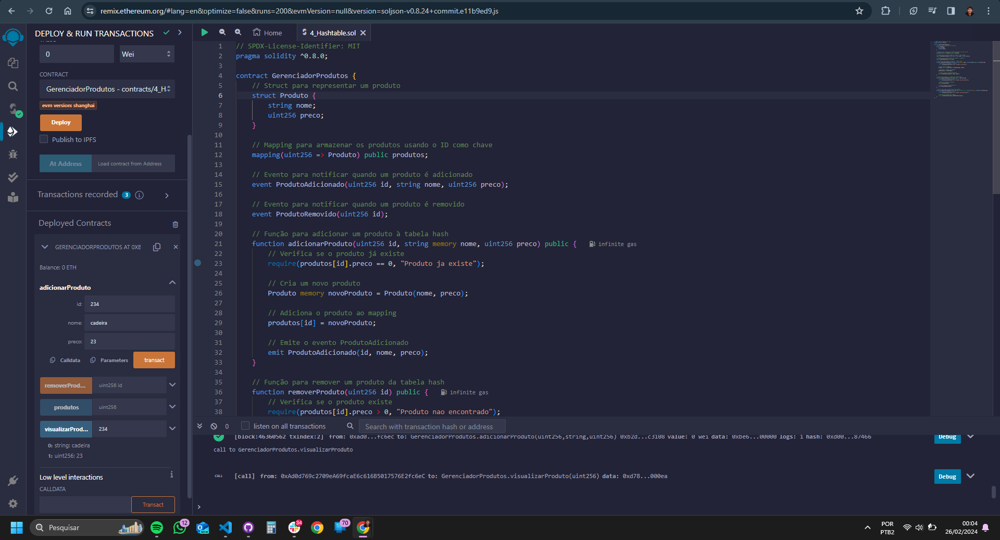

## Casos de teste da Tabela Hash (C++)

### Caso de teste 1

O primeiro caso de teste serve para adicionar um novo item na Lista Hash, a partir de dois parâmetros: Nome, ID.

### Caso de teste 2

O segundo caso de teste serve para mostrar os itens armazenados na Tabela Hash.

### Caso de teste 3

O terceiro caso de teste serve para remover itens da tabela. É preciso especificar o ID o item.

### Caso de teste 4

O quarto caso de teste serve para atualizar um item existente na tabela. É preciso identificar o ID do item a ser atualizado.

<figure>
  <figcaption style="text-align: center;">Figura 1 - Casos de teste C++</figcaption>
  </img>
  <figcaption style="text-align: center;">Fonte: Autoria Própria.</figcaption>
</figure>

## Casos de teste Solidity

Estes foram os casos de teste realizados na plataforma Remix. Eu criei uma carteira no Metamask e adicionei crédito. Após isso, conectei a minha carteira ao Remix e fiz o deploy do contrato. As requisições necessitam de créditos da minha carteira.

### Caso de teste 1

O primeiro caso de teste serve para adicionar um novo item na lista, a partir de dois parâmetros: Nome, ID, Valor.

### Caso de teste 2

O segundo caso de teste serve para remover um produto à partir do seu ID.

### Caso de teste 3

O terceiro caso de teste serve para visualizar os itens da lista à partir do seu ID.

<figure>
  <figcaption style="text-align: center;">Figura 2 - Casos de teste Solidity</figcaption>
  </img>
  <figcaption style="text-align: center;">Fonte: Autoria Própria.</figcaption>
</figure>
